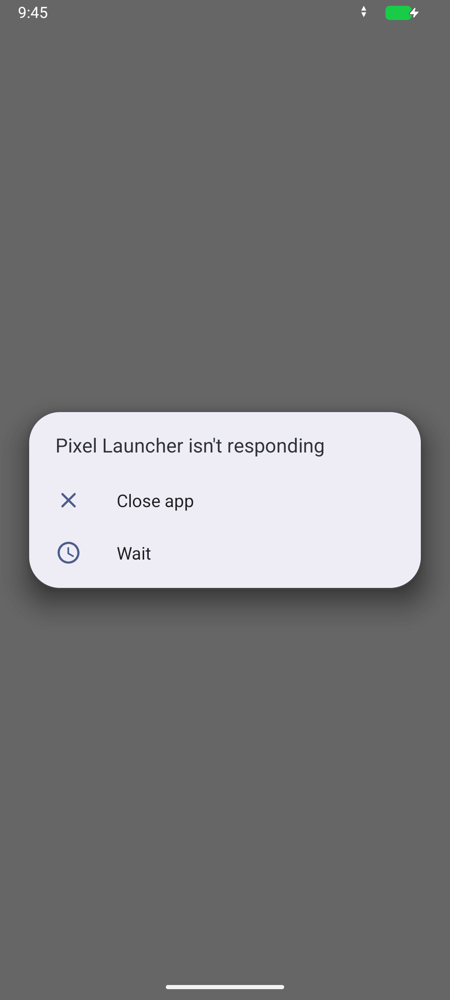
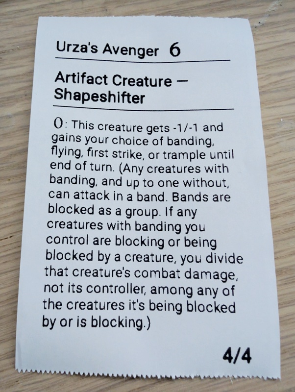

# InstantScryfallPrinter

A simple Android application for playing the Scryfall Printer format in Magic: the Gathering by printing to Bluetooth thermal printers.  Connect to any compatible Bluetooth thermal printer and use the autocomplete search to find a specific creature card on Scryfall and send it to the printer.

## Features

- Scan for and connect to paired Bluetooth thermal printers
- Works currently with standard thermal printers
- - Includes support for the cheap [PRT](https://www.amazon.com/dp/B0DYN9XLTQ)
- Quick access to creature cards via an autocomplete search

## Screenshots

| App Interface | Printed Output |
|:---:|:---:|
|  |  |

## Sideloading InstantScryfallPrinter

You can install the app directly from the [latest release](https://github.com/ROMzombie/InstantScryfallPrinter/releases/latest) without needing Android Studio or any development tools.

### Download the APK

1. On your Android device, open **Chrome** (or any browser) and go to the [Releases page](https://github.com/ROMzombie/InstantScryfallPrinter/releases/latest).
2. Under **Assets**, tap the file named `InstantScryfallPrinter-v*.apk` to download it.

### Enable "Install Unknown Apps"

Android blocks APK installs from outside the Play Store by default. You need to allow this once for the app you use to open the APK (usually your browser or file manager).

1. Go to **Settings → Apps → Special app access → Install unknown apps**.
2. Select the app you will use to open the APK (e.g. **Chrome** or **Files**).
3. Toggle **Allow from this source** to **ON**.

> **Note — Android 15+ (2026):** Newer devices may show additional security prompts as part of Android's Advanced Flow verification. Follow the on-screen instructions; you may need to enable Developer Options or confirm an extra authentication step before the install proceeds.

### Install the APK

1. Open your **Downloads** folder (or tap the download notification).
2. Tap the APK file and press **Install** when prompted.
3. Once installed, open **Scryfall Printer** from your app drawer.

> **Security tip:** After installing, go back to **Settings → Apps → Special app access → Install unknown apps** and toggle the permission back to **OFF** for the app you enabled it on.

---

## Development Setup

### Requirements

| Tool | Minimum Version |
|---|---|
| JDK | 17 (bundled with Android Studio Meerkat+) |
| Android Studio | Meerkat (2024.3.2) or newer |
| Android SDK | API 35 (Android 15) |
| Android Build Tools | 35.x |
| Gradle wrapper | 8.11.1 (managed automatically) |
| Android Gradle Plugin | 8.9.0 (managed automatically) |

### Cloning the Repository

```bash
git clone https://github.com/ROMzombie/InstantScryfallPrinter.git
cd InstantScryfallPrinter
```

### Opening in Android Studio

1. Launch Android Studio → **File → Open** → select the `InstantScryfallPrinter` folder.
2. Android Studio will detect the Gradle project and prompt you to sync — click **Sync Now**.
3. Install any missing SDK components listed in the SDK Manager if prompted.

### Building from the Command Line

```powershell
# Windows — debug build
.\gradlew assembleDebug

# Run unit tests (JUnit and Robolectric)
.\gradlew testDebugUnitTest

# Run lint
.\gradlew lint
```

## Testing

Instant Scryfall Printer uses **JUnit 4**, **Robolectric**, and **Mockito** for its testing framework to ensure code quality and stability.

### Running Tests Locally

To run all unit and integration tests locally, execute:
```powershell
.\gradlew testDebugUnitTest
```
This command will execute all Robolectric simulated Android tests (such as UI interaction states) and standard Java unit tests (such as JSON parsing logic). 

### Continuous Integration (CI) and Branch Protection

The repository is configured with a GitHub Actions workflow (`.github/workflows/pr-check.yml`) that automatically runs `./gradlew testDebugUnitTest` and `./gradlew lint` on all pull requests targeting the `master` branch.

**To ensure all tests pass before merging:**
The `master` branch has branch protection rules enabled on GitHub. The `Run Unit Tests` block acts as a mandatory status check, ensuring that no breaking changes are merged into production.

---

## Developing with Antigravity on Windows

[Antigravity](https://antigravity.dev) is an AI coding assistant that runs inside VS Code and pairs with Android Studio for Android development. The recommended workflow on Windows is:

### Prerequisites

1. **VS Code** with the **Antigravity** extension installed.
2. **Android Studio** installed and the Android SDK configured at a path with no spaces (e.g. `C:\Android\Sdk`).
3. Ensure `ANDROID_HOME` is set in your system environment variables:
   ```powershell
   [System.Environment]::SetEnvironmentVariable("ANDROID_HOME", "C:\Android\Sdk", "User")
   ```
4. Add the platform-tools directory to your `PATH` so `adb` is available everywhere:
   ```powershell
   # Add to your PowerShell profile or system PATH
   $env:PATH += ";C:\Android\Sdk\platform-tools"
   ```

### Opening the Project

1. Open the `InstantScryfallPrinter` folder in VS Code.
2. Antigravity will detect the Gradle project structure and provide code navigation, refactoring, and build assistance.
3. For UI editing and emulator management, keep Android Studio open alongside VS Code.

### Recommended Workflow

- Use **Antigravity / VS Code** for: code edits, refactoring, README changes, Gradle config, git operations.
- Use **Android Studio** for: Layout Editor, emulator, `Run` / `Debug`, Logcat, Profiler.
- Build and install via the command line (see ADB section below) to iterate quickly without leaving VS Code.

---

## Deploying to a Local Device via ADB

### Enable Developer Mode on Your Device

1. Go to **Settings → About Phone**.
2. Tap **Build Number** seven times until you see *"You are now a developer"*.
3. Go to **Settings → Developer Options** and enable:
   - **USB Debugging**
   - (Optional) **Wireless Debugging** for cable-free deployment

### Wired Deployment

1. Connect your device via USB.
2. Accept the *"Allow USB Debugging"* prompt on the device.
3. Verify the device is detected:
   ```powershell
   adb devices
   # Expected output: <serial>   device
   ```
4. Build and install:
   ```powershell
   .\gradlew installDebug
   ```
   The app will be installed and available in your app drawer.

### Wireless Deployment (Android 11+)

1. On the device: **Settings → Developer Options → Wireless Debugging → Enable**.
2. Tap **Pair device with pairing code** and note the IP, port, and code shown.
3. Pair from PowerShell:
   ```powershell
   adb pair <ip>:<pairing-port>
   # Enter the pairing code when prompted
   ```
4. Connect to the device:
   ```powershell
   adb connect <ip>:<port>
   adb devices   # confirm it shows "device"
   ```
5. Install:
   ```powershell
   .\gradlew installDebug
   ```

### Useful ADB Commands

```powershell
# View live logcat output (filter to your app)
adb logcat --pid=$(adb shell pidof -s net.romzombie.scryfallprinter)

# Uninstall the app
adb uninstall net.romzombie.scryfallprinter

# Reboot the device
adb reboot
```
